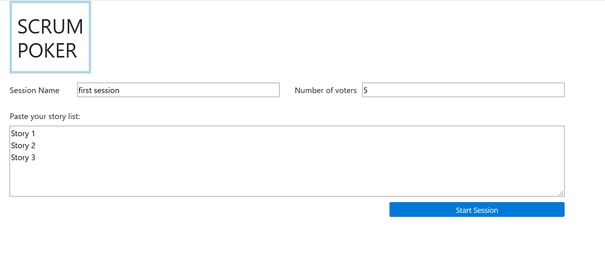
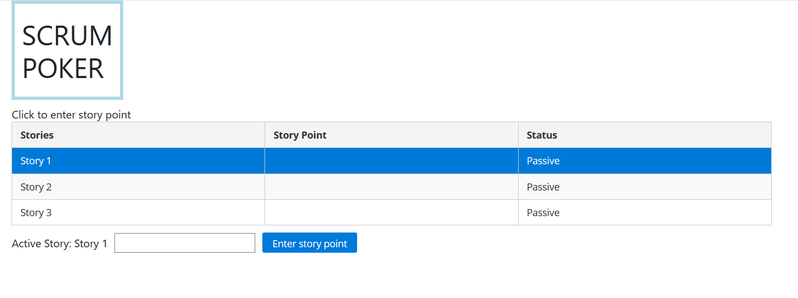

# SCRUM POKER PLANNING WEB APP

Project runs with node js express backend and angular 9 frontend

## Start

- Clone project

- Open terminal in project folder

```bash
cd backend
npm start
```
- Open new terminal in project folder

```bash
cd frontend
npm start
```
- Go to [http://localhost:4200](http://localhost:4200)

## Design



